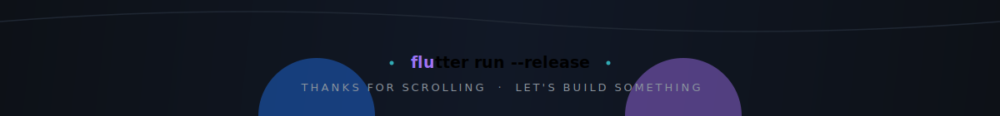

<!-- ─────────────────────────── HEADER ─────────────────────────── -->


<div align="center">
  
</div>

<div align="center">
  
  
  
  
</div>



<!-- ─────────────────────────── ABOUT ─────────────────────────── -->
## <samp>whoami</samp>


```dart
class Ayman extends Developer {
  @override
  String get role => 'Mobile Application Developer';

  @override
  List<String> get stack => ['Flutter', 'Dart', 'Firebase', 'Bloc'];

  @override
  String get shipping => 'Delalty · Moghtareb @ Avnology';

  @override
  String get learning => 'NestJS · Clean Architecture · IoT';

  @override
  Future<void> reachOut() => mailto('aymanaboelela222@gmail.com');
}
```

`▸` Production Flutter apps end-to-end — UI, state, API, store release.
`▸` Opinionated about **Clean Architecture**, **Bloc/Cubit** and design systems.
`▸` Arabic-first by default — full **RTL** and localization, never an afterthought.
`▸` Currently wiring **ESP32-S3 relays over MQTT** into a Flutter controller.

<br clear="right"/>


<!-- ─────────────────────────── STACK ─────────────────────────── -->
## <samp>stack</samp>

<table align="center">
  <tr>
    <td align="right"><b>Mobile</b></td>
    <td>
      <a href="https://flutter.dev" title="Flutter"></a>
      <a href="https://dart.dev" title="Dart"></a>
      <a href="https://kotlinlang.org" title="Kotlin"></a>
      <a href="https://developer.apple.com/swift/" title="Swift"></a>
      <a href="https://developer.android.com/studio" title="Android Studio"></a>
    </td>
  </tr>
  <tr>
    <td align="right"><b>Backend</b></td>
    <td>
      <a href="https://firebase.google.com" title="Firebase"></a>
      <a href="https://nestjs.com" title="NestJS"></a>
      <a href="https://nodejs.org" title="Node.js"></a>
      <a href="https://www.typescriptlang.org" title="TypeScript"></a>
      <a href="https://supabase.com" title="Supabase"></a>
    </td>
  </tr>
  <tr>
    <td align="right"><b>Data</b></td>
    <td>
      <a href="https://www.postgresql.org" title="PostgreSQL"></a>
      <a href="https://www.prisma.io" title="Prisma"></a>
      <a href="https://www.sqlite.org" title="SQLite"></a>
      <a href="https://www.mongodb.com" title="MongoDB"></a>
    </td>
  </tr>
  <tr>
    <td align="right"><b>Tools</b></td>
    <td>
      <a href="https://git-scm.com" title="Git"></a>
      <a href="https://github.com" title="GitHub"></a>
      <a href="https://www.postman.com" title="Postman"></a>
      <a href="https://www.figma.com" title="Figma"></a>
      <a href="https://code.visualstudio.com" title="VS Code"></a>
      <a href="https://www.linux.org" title="Linux"></a>
    </td>
  </tr>
</table>


<!-- ─────────────────────────── WORK ─────────────────────────── -->
## <samp>selected work</samp>

<table align="center">
  <tr>
    <td width="50%" valign="top">
      <h3><a href="https://github.com/aymanaboelela/delalty-app">Delalty · دلالتي</a></h3>
      Real-estate platform for Avnology — Flutter client backed by a
      <a href="https://github.com/aymanaboelela/delalty-api">NestJS + Postgres API</a>.
      <br/><br/>
      
      
      
    </td>
    <td width="50%" valign="top">
      <h3><a href="https://github.com/aymanaboelela/smart_home">smart_home</a></h3>
      Flutter controller for ESP32-S3 relay boards over MQTT / Magistrala —
      Wi-Fi provisioning, live telemetry, automation.
      <br/><br/>
      
      
      
    </td>
  </tr>
  <tr>
    <td width="50%" valign="top">
      <h3><a href="https://github.com/aymanaboelela/moghtareb-landing">Moghtareb · مغترب</a></h3>
      Egypt's first student-housing app. I built the landing experience.
      <br/><br/>
      
      
    </td>
    <td width="50%" valign="top">
      <h3><a href="https://github.com/aymanaboelela/skin-cancer-detection-Derma-Check-App">Derma Check</a></h3>
      Skin-cancer screening from a phone camera, ML model behind a Flutter UI.
      <br/><br/>
      
      
    </td>
  </tr>
  <tr>
    <td width="50%" valign="top">
      <h3><a href="https://github.com/aymanaboelela/Help-Me-App">Help-Me-App</a> ⭐ 2</h3>
      Community requests & help board, Flutter + Firebase.
      <br/><br/>
      
      
    </td>
    <td width="50%" valign="top">
      <h3><a href="https://github.com/aymanaboelela/Qubic-AI">Qubic AI</a></h3>
      Gemini-powered chatbot — Bloc state, Hive-persisted history.
      <br/><br/>
      
      
    </td>
  </tr>
</table>


<!-- ─────────────────────────── STATS ─────────────────────────── -->
## <samp>the numbers</samp>

<div align="center">
  
  
</div>

<div align="center">
  
</div>

<div align="center">
  
</div>

<div align="center">
  
</div>


<!-- ─────────────────────────── SNAKE ─────────────────────────── -->
## <samp>contribution snake</samp>

<div align="center">
  <picture>
    <source media="(prefers-color-scheme: dark)" srcset="https://raw.githubusercontent.com/aymanaboelela/aymanaboelela/output/github-snake-dark.svg" />
    <source media="(prefers-color-scheme: light)" srcset="https://raw.githubusercontent.com/aymanaboelela/aymanaboelela/output/github-snake.svg" />
    
  </picture>
</div>


<!-- ─────────────────────────── CONNECT ─────────────────────────── -->
## <samp>say hi</samp>

<div align="center">
  <a href="mailto:aymanaboelela222@gmail.com">
    
  </a>
  <br/>
  <a href="https://wa.me/20"></a>
  <a href="https://fb.com/aymanaboelela"></a>
  <a href="https://instagram.com/2ayman6"></a>
  <a href="https://www.youtube.com/c/aymanaboelela"></a>
</div>


