  

<h3 align="center">A Flutter developer from Egypt </h3>

  

### 👨‍💻 About me

- 🔭 &nbsp;I'm currently building **[Delalty](https://github.com/aymanaboelela/delalty-app)** and **Moghtareb** at **Avnology**
- 🔌 &nbsp;Working on a **[smart-home controller](https://github.com/aymanaboelela/smart_home)** — ESP32-S3 relays over MQTT
- 🌱 &nbsp;Currently learning **NestJS, Clean Architecture, IoT**
- 🌍 &nbsp;I build **Arabic-first** apps — full RTL and localization, never an afterthought
- 🛠️ &nbsp;Ask me about **Dart, Flutter, Firebase, Bloc, state management**

### 💬 Connect with me

<table>
  <tr>
    <td>
      
    </td>
    <td>
      
    </td>
    <td>
      
    </td>
    <td>
      
    </td>
  </tr>
</table>

### 🛠️ Tech Stack

  
  
  
  
  
  
  
  
  
  
  
  
  
  
  
  
  
  
  
  

### 📊 GitHub Analytics

  
  

  

### 🐍 Contribution Snake

  <picture>
    <source media="(prefers-color-scheme: dark)" srcset="https://raw.githubusercontent.com/aymanaboelela/aymanaboelela/output/github-snake-dark.svg" />
    <source media="(prefers-color-scheme: light)" srcset="https://raw.githubusercontent.com/aymanaboelela/aymanaboelela/output/github-snake.svg" />
    
  </picture>

